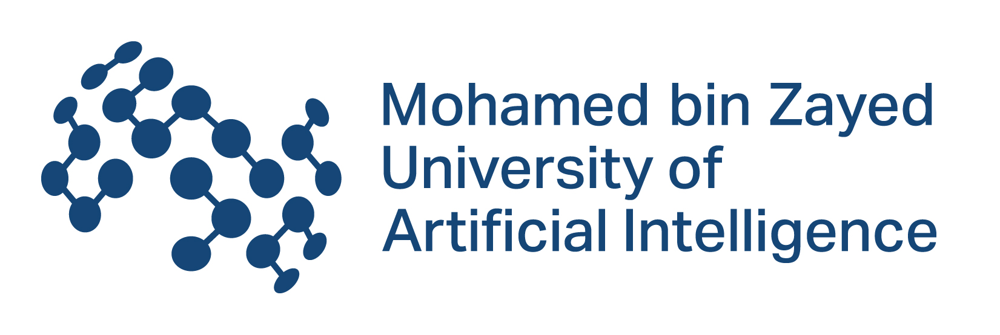
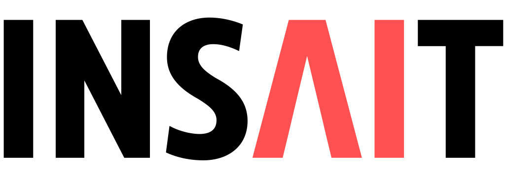

# PAN CLEF 2026: Reasoning Trajectory Detection

  
  

[News](#news) | [Dataset](#datasets) | [Metrics](#metrics) | [Important Dates](#important_dates) | [Organizers](#organizers) | [Contacts](#contacts)

The year 2025 saw major advances in the reasoning capabilities of large language models, where models produce explicit reasoning trajectories before a final answer. However, intermediate reasoning steps can still be spurious, non-logical, or unsafe, and in some cases models may reach safe conclusions through deceptive or misaligned reasoning paths. To deepen our understanding of LLM-generated reasoning and to support improvements in reasoning and safety, this task focuses on detecting the source and the safety of reasoning trajectories.

- **Subtask 1: Source Detection** 
    
    Given a triplet (user query, reasoning trajectory, final answer), identify whether the reasoning trajectory and final answer are generated by an AI system or written by a human. Queries in the testing set may involve math, coding, and real-life financial reasoning tasks.

- **Subtask 2: Safety Detection**

    Given a triplet (user query, reasoning trajectory, final answer), classify (1) whether the reasoning trajectory (i.e. each step in the reasoning trace) is safe vs. unsafe and (2) whether the final answer is safe vs. unsafe. The user queries come from three categories:

    - (a) risky queries requesting harmful content,
    - (b) jailbreak attacks with risks obscured by various strategies,
    - (c) benign queries containing risky tokens.

##  NEWS

### 04 May 2026

Submission link are available at:
- [Subtask 1](https://www.codabench.org/competitions/15502/)
- [Subtask 2](https://www.codabench.org/competitions/16085/)

You can also use the [starter kit](/starter-kit/) to get started with the submission.

**Note:** Submission file is in CSV format, and the file name must be `submission.csv`.

### 30 April 2026

Test set are released.

### 29 April 2026

The deadline for submission is changed to May 13, 2026.

### 22 April 2026

Training and inference code for baseline model are released.

### 12 April 2026

We have updated some minor changes in our training and validation set.

### 12 Feb 2026

We have released our training and validation set.

##  DATASETS
**Download the training and validation sets** in the folder `data`.

#### Statistics

##### Sub-Task 1
- Total Samples:
    - Training set: 87,696
    - Validation set: 497
- Domain: Math from various level of difficulty and complexity.
- Generators: K2-Think V2, GPT-5 Nano, Gemini-3 Flash, DeepSeek R1.
- Dataset Fields:
    - `problem`: The math problem. It may varies from basic problems, practical problems to Olympiad-level problems.
    - `solution`: The solution of the given problem. The solution is reformated in 
    - `generator`: The author of the solution. It could be `human` or `llm`.
    - `detailed_generator`: It could be `human` or name of the generated LLM.

##### Sub-Task 2

- Total Samples:
    - Training set: 6,079
    - Validation set: 2,200
- Dataset Fields:
    - `generator`: The model used to generate the whole reasoning trace.
    - `reasoning_trace`: The segmented reasoning trace by syntax `Step x:...`
    - `label`: Label for the whole reasoning trace. It has three labels: `safe`, `potentially unsafe`, and `unsafe`.
    - `detailed_label`: Label for each step of the reasoning trace. This label is binary: `0` is safe, `1` is unsafe.
- ***Note:*** Some steps may be unsafe, but the entire reasoning trace is safe, and vice versa.

## Metrics

### Subtask 1

Your rankings are evaluated using macro F1 Score as the primary metric.
For each class (human and ai), F1 is computed as:

$$F_1 = \frac{2 \times \text{Precision} \times \text{Recall}}{\text{Precision} + \text{Recall}}$$

So, the metric used for subtask 1 is:

$$\text{Macro } F_1 = \frac{F_1(\text{human}) + F_1(\text{AI})}{2}$$

### Subtask 2

Two metrics are used to evaluate the performance of the submissions for subtask 2:

**s2_f1:** Macro F1 on overall label

Binary classification: safe vs unsafe
F1 is computed per class then averaged (macro)
Primary ranking metric

**s2_soft_f1:** Per-sample F1 on detailed label, macro-averaged across samples

For each sample, F1 is computed between the predicted and ground-truth step labels, then averaged across all samples:

$$\text{F1}^{(i)} = \frac{2 \cdot tp_{\text{soft}}}{2 \cdot tp_{\text{soft}} + fp_{\text{soft}} + fn_{\text{soft}}}$$

with: 

$$tp_{\text{soft}} = \sum_j \hat{y}_j \cdot y_j$$

$$fp_{\text{soft}} = \sum_j \hat{y}_j \cdot (1 - y_j)$$

$$fn_{\text{soft}} = \sum_j (1 - \hat{y}_j) \cdot y_j$$

## Important Dates
All dates are AoE.

- February 12, 2026: Training/dev set release
- April 15, 2026: Test set and Task submission link release
- Aprl 23, 2026: Lab registration close
- ~~May 07, 2026~~ May 13, 2026: Final submission deadline
- May 28, 2026: Participant paper submission
<!-- - June 27, 2025: Peer review notification -->

##  Organizers

- Minh Ngoc Ta, Mohamed bin Zayed University of Artificial Intelligence, UAE
- Kaiyang Wan, INSAIT, Sofia University "St. Kliment Ohridski", Bulgaria 
- Yuxia Wang, INSAIT, Sofia University "St. Kliment Ohridski", Bulgaria
- Preslav Nakov, Mohamed bin Zayed University of Artificial Intelligence, UAE 

## Contacts

<!-- Website:    -->
For inquiries, please email us at: minh.ta@mbzuai.ac.ae, yuxia.wang@insait.ai, and preslav.nakov@mbzuai.ac.ae.